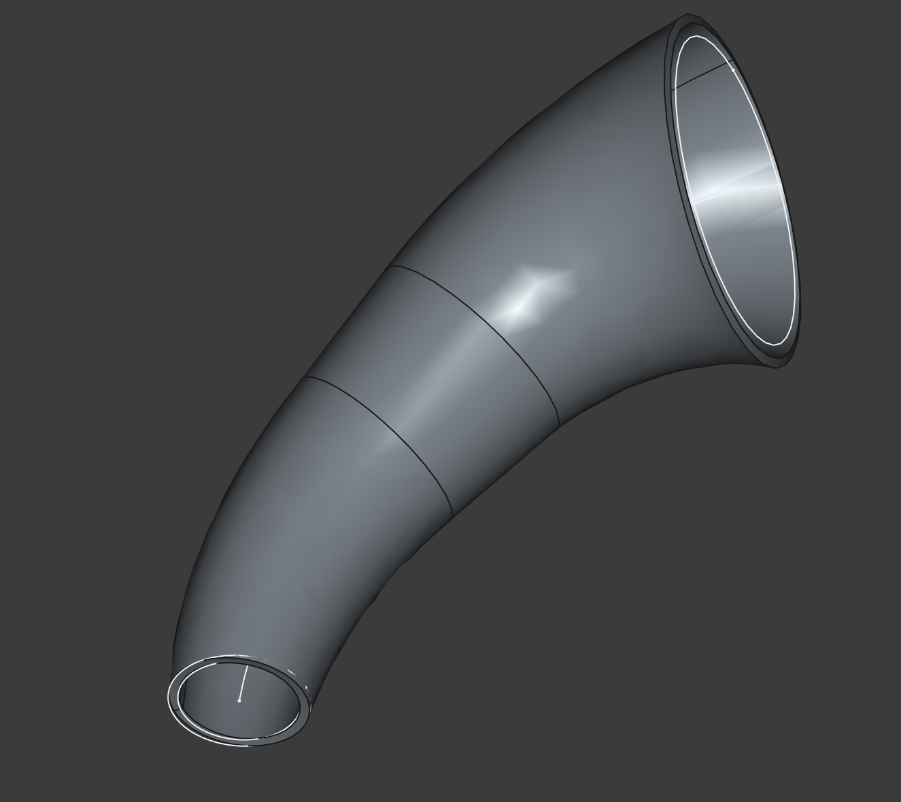

VariableCircleSweep
===================

Yoshinobu Ishizaki
2026-01-03

[FreeCAD](https://www.freecad.org/) python script to sweep varying circle profiles along with a center path sketch.

## Usage
1. Create or Import a `Spreadsheet` object with two columns:
    - Column A: path length positions `s` along the center path (in mm)
    - Column B: diameters `d` of the circle at those positions (in mm)
2. Create a `Sketch` representing the center path for the sweep.
3. Select the `Sketch` , then `Spreadsheet` in the FreeCAD GUI.
4. Run this macro to generate a varying circle sweep shape with given thickness. You can specify its thickness and direction in the task dialog.

## Notes
- Created sweep will be extended when the center path is longer than the data in the spreadsheet.
- If sweep fails with `Geom_BSplineSurface: Weights values too small`, try decreasing the number of points in the spreadsheet.

## Sample

See [variable_circle_sweep_sample.FCStd](variable_circle_sweep_sample.FCStd) for the FreeCAD project file used to generate the above image.

## License
This project is licensed under the MIT License - see the [LICENSE](LICENSE) file for details.

## Remarks

This script is initially written for designing horn bell shape with FreeCAD in [horn_design](https://github.com/Yoshinobu-Ishizaki/horn_design).

